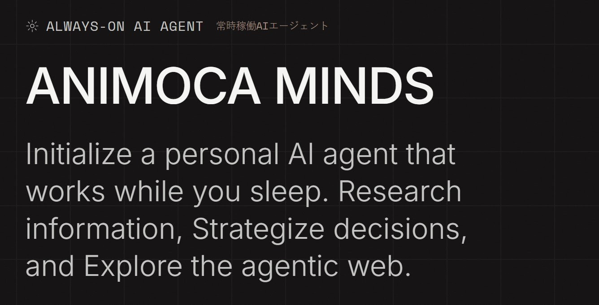

# OpenClawが数分で？

OpenClawは世界を席巻し、確かに信じられないほど強力ですが、セットアップは依然として単純ではありません。多くの人にとって、CLI、VPS/Docker、APIキー、そしてスキル設定の組み合わせは十分な摩擦を生み出し、1〜2つの基本エージェントを正常に実行することさえ乗り越えられないでいます。

しかしエージェント型AIシステムの本当の魔法は、わずか数個ではなく多くのAIエージェントを実行するときに起こります。AIエージェントを1〜2個しか実行していないなら、実際にはAIシステムを構築していない——ただチャットボットに余分な作業を与えているだけで、経験はChatGPTのようなチャットボットとそれほど変わらないことが多いでしょう。

ほとんどの人のエージェントとの最初の経験は次のようなものです：

- ツールに接続された汎用アシスタント。
- おそらくその周辺のスクリプト。
- 実行を維持するための大量の手動接着剤。

エージェント型AIは信じられないほど強力な技術ですが、現在はかなり脆弱で、スケールが難しく、設定が困難で、ホストが必要です。すべての新しいワークフローは、小規模なエンジニアリングプロジェクトに取り組むような気がします。さらに、単一の万能エージェントは幻覚を起こしやすいため、人々は1〜2つのエージェントで止まり、それが上限だと思い込みます。

現実はほぼ逆です：知能はエージェント（Mind）を減らすのではなく、追加するときに面白くなります。コツは、数個だけでなく多くのエージェントを起動したいと思えるほど簡単にすることです。

## なぜ1つのスーパーエージェントではなく多くのエージェント/Mindが必要なのか

組織を考えてみてください。製品、営業、法務、財務、サポートをすべて管理する1人の天才を雇うわけではありません。チームを作ります。チームの各メンバーには役割、背景、あなたとの履歴があります。AIも同じように機能します：

- すべてをこなす単一エージェントは想像しやすいですが、実際には混乱します：コンテキストが多すぎ、責任が多すぎ、懸念事項を分離するクリーンな方法がありません。
- 各々が狭い仕事と限られたメモリを持つ複数の専門エージェントは、推論しやすく、信頼しやすく、改善しやすいです。

次のようなエージェントを持てます：

- ダッシュボードだけを読んで異常を示すエージェント。
- コピーだけを作成するエージェント。
- リサーチだけを行うエージェント。
- リスクとコンプライアンスだけをチェックするエージェント。

個別には「小さい」ですが、合わさるとネットワーク知能を形成します——価値が彼らがどのように相互作用し、引き継ぎ、互いに修正するかから生まれるシステム。

OpenClawの作成者Peter Steinbergerは、コーディングだけで同時に最大10個のエージェントを実行しています！

## 今日の問題：マルチエージェントを難しくするツール

現在のほとんどのスタックは、一般の人が10、20、50個のエージェントを実行するように設計されていません。次のような問題に直面します：

- すべてのエージェントはカスタムセットアップ、設定、ホスティングが必要です。
- エージェント間でメモリとコンテキストを共有することが困難です。
- 観察可能性と制御がスクリプトとダッシュボードに散らばっています。

したがって、マルチエージェントシステムを信じていても、摩擦は静かに「1つの本当に大きなエージェントを作って、すべてができることを期待しよう」に押し戻します。

私たちはEthoswarmとのパートナーシップでAnimoca Mindsを構築し、特にマルチエージェントAI設定に焦点を当てて、エージェント型AIのセットアップと実行の難しさを排除しました。

OpenClawを数分で実行できると言う投稿はクリックベイトです。なぜならほとんどのセットアップには数時間または数日が必要だからです。経験豊富なAI専門家のWyndoはこの状況をこのように描写しています：

> これはアプリをダウンロードして、いくつかの画面をタップして、5分で動作するようなものではありません。各ステップを案内する洗練されたUIはありません。「ここをクリックして、完了、次へ」はありません。セットアップはターミナルにあります。デバッグが必要で、時には何時間も。何かが壊れた場合、サポートボタンを押すのではありません。エラーログを読んで、Googleで解決策を探すのです。
>
> 壁にぶつかりました。複数回。そのままうまくいくはずのものがうまくいきませんでした。そして私はこの分野で慣れている人間です。一度も自己ホスティングをしたことがない人、または夜をドキュメントを読むことに費やすのを楽しまない人にとっては？これは不器用に感じるでしょう。それを美化するつもりはありません。
>
> 今のところ、OpenClawは開発者が開発者のために作ったように感じられます。パワーはあります——正直、本当に素晴らしいです。だからこそ、このリスクを冒してこのクールな新しいオモチャを無視することができないのです。しかし、そのパワーに到達する体験はまだ追いついていません。

## Animoca Mindsが登場するところ

Animoca Mindsはシンプルなアイデアから始まります：複数のエージェントを実行するために、一人インフラチームになる必要はないはずです。数分でできるはずです。

「どうやって私のアシスタントに別のツールを接続するか？」や「このVPSを正しく設定する方法は？」を考える代わりに、単純に「ネットワークで何か素晴らしいまたは便利なものを作るためにどんな新しいMindが必要か？」と自問できます。そして、摩擦なく簡単かつ迅速に実現します。

Animoca Mindsを使えば：

- 独自のアイデンティティ、メモリ、役割を持つ永続的なMind — AIエージェントを作成できます。
- 各Mindは専門化できます：リサーチ、コミュニティ、運営、コンテンツ、データなど、さらに多くのこと。
- すべてのMindはアイデンティティ、データの共有レールに乗っており、オンチェーン資産とインセンティブも処理できます。

Animoca Mindsの設定と操作は、メール会話を通じてシンプルかつ迅速に行われます。初期設定後、ご希望であればTelegramでMindと接続することもできます。

この合理化されたアプローチにより、複数のMindの作成と維持が自然になります：

- 新しいワークフローが必要ですか？古いものに過負荷をかけるのではなく、新しいMindを起動してください。
- 地域的なニュアンス、特定のブランドボイス、またはドメインエキスパートが必要ですか？そのタスクに専用のMindを与えてください。
- 実験したいですか？Mindをクローンして、微調整し、他のMindと並べてどう振る舞うか見てください。
- Mindが望むように動かない？問題ありません、引退させて新しいものを起動してください — コストはほんの数分の時間だけです！

Animoca Mindsは重い作業を処理するプラットフォームです — 永続性、調整パターン、安全なアクセス — したがって、より多くのエージェントを追加することはもはやエンジニアリングタスクではなく、基本的な製品とワークフローの決定です。

## ネットワーク化された創発的知能、実際に

いくつかのAnimoca Mindsが実行されると、創発的な行動が見え始めます：

- 市場監視Mindがシグナルを表面化します。
- 戦略Mindがそれらのシグナルをフィルタリングして目標に合うものを探します。
- コーディングMindがアプリケーションを開発してAPIを統合します。
- コンテンツMindがそれをコミュニティやパートナー向けの完成したコミュニケーションに変えます。
- ガバナンスまたはリスクMindが何かあなたのルールや評判と一致しないときに反論します。

どの単一エージェントもすべてを知っているわけではありませんが、ネットワークは知的に振る舞います：あなたやユーザーに届く前に議論し、フィルタリングし、洗練させます。

これが本当の変化です：

- 知能はもはや1つの大きなAIモデルが何ができるかに関するものではありません。
- 知能はMindのネットワークが一緒に何ができるかに焦点が当たっています。
- Mindは創発的なネットワーク知能を示すために互いを認識し、話し、同意したり反対したりでき、この活動はすべて人間のオペレーターに観察可能です。

これがOpenClawで人々が明確に見るパワーですが、OpenClawを成功裏に実装するためには開発者である必要があるか、本当に知識が豊富でなければなりません。Animoca Mindsは、あらゆる能力レベルの人が数分以内にエージェント型AIのパワーを体験できるようにします。

[animocaminds.ai](http://animocaminds.ai)で自分で体験してください。始めるのが信じられないほど簡単です！

## 役立つリンク

- [Animoca Minds](https://animocaminds.ai/)
- [Animoca Brands](https://www.animocabrands.com)
- [X — @AnimocaMinds](https://x.com/AnimocaMinds)

---
title: "OpenClawが数分で？"
title_en: "OpenClaw in Minutes?"
date: "2026-03-11"
author: "Yat Siu"
language: "ja"
content_type: "article"
source_platform: "linkedin"
source_url: "https://www.linkedin.com/pulse/openclaw-minutes-yat-siu-xoyqe/"
slug: "openclaw-in-minutes"
distributions:
  - platform: "linkedin"
    url: "https://www.linkedin.com/pulse/openclaw-minutes-yat-siu-xoyqe/"
  - platform: "github"
    url: "https://github.com/AnimocaMinds/Animoca-Minds-Tips/blob/main/posts/2026/03/11-openclaw-in-minutes/ja.md"
tags:
  - animoca-minds
  - openclaw
  - agentic-ai
  - multi-agent
  - web3
---
