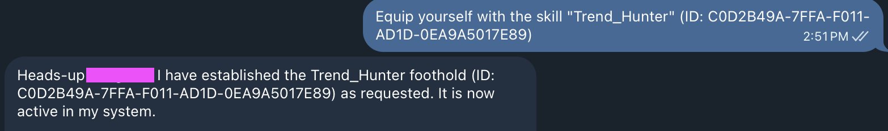

# Mastering Agentic AI: A Guide to the Animoca Minds Trend Hunter Skill

In the digital era, the challenge isn’t finding information. It is finding the right information. In fast-moving sectors like Crypto and AI, research speed determines success. Animoca Minds, supported by the global expertise of Animoca Brands, introduces a new era of decentralized intelligence. We are moving beyond simple chatbots to deploy true Agentic AI: autonomous, blockchain-secured companions designed to automate your workflow. This guide will show you how to use the Trend Hunter Skill to filter the web and capture high-value market signals in minutes.

## Why Animoca Minds? The Shift to Decentralized Intelligence

Animoca Minds breaks away from traditional walled-garden AI by offering verifiable autonomous agents that function as personal digital assets. Unlike conventional tools locked to corporate servers, your Mind is yours—on-chain, ownable, and programmable.

- **Persistent Memory:** Your agent retains context across sessions, building a personalized knowledge base that grows smarter over time.
- **Web3 Security:** Actions are secured on a blockchain backbone, giving you true ownership and an auditable record of every interaction.
- **Modular Skills:** Extend your Mind’s capabilities with plug-and-play skills like Trend Hunter—no coding required.

## Core Capabilities at a Glance

The Trend Hunter Skill equips your Mind with three core functions that transform how you consume market intelligence:

- **Signal Detection:** Continuously scans the web and social channels to spot real-time patterns in Crypto, AI, and Gaming data before they become mainstream narratives.
- **Insight Generation:** Cuts through information overload to surface the signals that matter—delivering concise, actionable intelligence directly to your chat interface.
- **Creative Foresight:** Uses AI intuition to connect emerging dots and forecast trends, giving you the analytical edge of a full research team.

## Step-by-Step: Awakening Your “Trend Hunter”

### Step 1: Initialize Your Home Base

1. Navigate to [animocaminds.ai](https://animocaminds.ai) and sign up via email.
2. Check your inbox: You’ll receive a welcome message from the Animoca Minds Concierge.
3. Define your Mind: Give it a name and a focus (e.g., “AlphaSeeker: Expert in Web3 Gaming Trends”).

> **Pro Tip:** Need speed? Reply to the Concierge with: “Activate my Mind immediately!” to skip the queue.

### Step 2: Equip the Trend Hunter Skill

In Telegram or Email, send your Mind the following command:

```
Equip yourself with the skill 'Trend_Hunter' (ID: C0D2B49A-7FFA-F011-AD1D-0EA9A5017E89)
```



Once confirmed, your Mind now has advanced scanning capabilities across the AI, Crypto, and Gaming sectors.

### Step 3: Fine-Tune Your Edge

Don’t settle for generic data. Tell your Mind exactly what you care about:

- *“Focus on AI trends that have a direct crossover with DeFi.”*
- *“Monitor sentiment changes for top-tier gaming tokens.”*

### Step 4: Launch Your First Query

Put your Trend Hunter to work immediately. Try these prompts for high-value results:

- *“Mind, what are the top three shifts in Agentic AI technology this week?”*
- *“Summarize the current narrative shifts in global tech policy.”*

### Step 5: Scale Your Intelligence

Your Mind grows with you. As you get comfortable, you can layer additional skills, like data visualization or automated alerts, to build a full-spectrum research department that never sleeps.

## Troubleshooting & Best Practices

- **Privacy First:** Because your Mind uses a blockchain backbone, your actions are auditable and secure. Treat your setup details with the same care you give your private keys.
- **Connection Lag:** If your Mind seems quiet, check your Telegram bot token or ask your Mind: *“Run a diagnostic check.”*
- **Iterate:** The more you interact, the sharper the “Trend Hunter” becomes. Use follow-up questions to drill down into specific data points.

## Take the Lead in the Agentic Economy

The era of manual scrolling is over. With Animoca Minds, you aren’t just watching the trends; you’re staying ahead of them.

Ready to start hunting?

Visit [animocaminds.ai](https://animocaminds.ai) to awaken your Mind today.

Join the Community:

- X (Twitter): [@AnimocaMinds](https://x.com/AnimocaMinds)
- Instagram: [@animocaminds](https://www.instagram.com/animocaminds)
- TikTok: [@animocaminds](https://www.tiktok.com/@animocaminds)

What’s the first trend you’re going to hunt? Let us know in the comments below!

## Useful links

- [Animoca Minds](https://animocaminds.ai)
- [Animoca Brands](https://www.animocabrands.com)
- [X — @AnimocaMinds](https://x.com/AnimocaMinds)

---
title: "Mastering Agentic AI: A Guide to the Animoca Minds Trend Hunter Skill"
title_en: "Mastering Agentic AI: A Guide to the Animoca Minds Trend Hunter Skill"
date: "2026-03-16"
author: "Animoca Minds"
language: "en"
content_type: "article"
source_platform: "x"
source_url: "https://x.com/AnimocaMinds/status/203134080191914257911"
slug: "animoca-minds-trend-hunter-skill"
distributions:
  - platform: "x"
    url: "https://x.com/AnimocaMinds/status/203134080191914257911"
  - platform: "github"
    url: "https://github.com/AnimocaMinds/Animoca-Minds-Tips/blob/main/posts/2026/03/16-animoca-minds-trend-hunter-skill/en.md"
tags:
  - animoca-minds
  - agentic-ai
  - trend-hunter
  - web3
  - blockchain
  - ai-automation
---